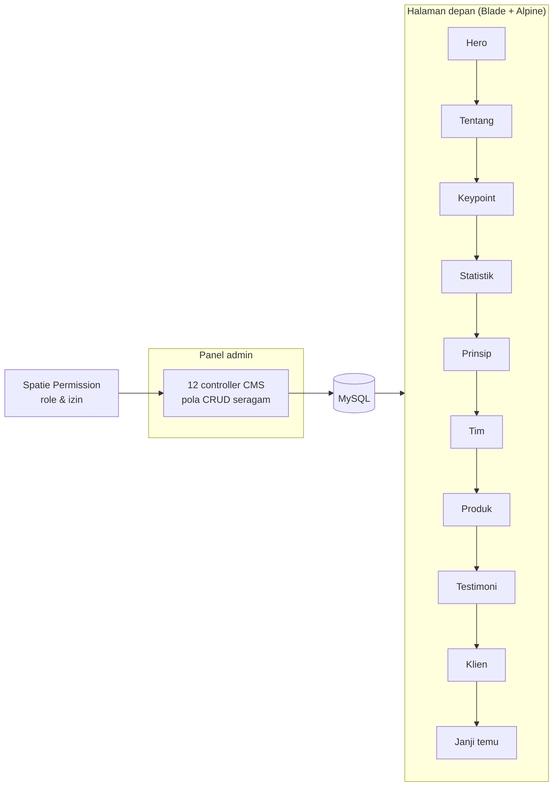

# Kreasi Uap

> Situs profil perusahaan dengan CMS penuh — setiap bagian halaman depan bisa diubah
> dari panel admin tanpa menyentuh kode.

| | |
|---|---|
| **Peran** | Pengembang |
| **Periode** | Juni 2024 — Desember 2024 |
| **Stack** | Laravel · PHP · Blade · Spatie Permission · Alpine.js · Tailwind CSS · Vite · MySQL |
| **Ukuran** | ±12.500 baris · 12 modul CMS |

---

## 1. Masalah yang diselesaikan

Situs profil perusahaan biasanya dibuat sekali lalu ditinggalkan, dan setiap perubahan
kecil — mengganti foto tim, menambah testimoni, memperbarui angka statistik — kembali
lagi ke pengembangnya.

Sistem ini memindahkan seluruh isi halaman depan ke basis data, dan memberi pemiliknya
panel untuk mengubahnya sendiri.

---

## 2. Struktur

Setiap seksi halaman depan punya controller-nya sendiri:
`HeroSectionController`, `CompanyAboutController`, `CompanyKeypointController`,
`CompanyStatisticController`, `OurPrincipleController`, `OurTeamController`,
`ProductController`, `TestimonialController`, `ProjectClientController`,
`AppointmentController`, `FrontController`, `ProfileController`.

Polanya sengaja dibuat seragam. Menambah seksi baru berarti menyalin pola yang sudah
ada, bukan merancang ulang — dan orang berikutnya yang membuka repo ini hanya perlu
memahami satu pola.

---

## 3. Keputusan

**Blade + Alpine.js, bukan SPA.** Ini situs profil perusahaan — tujuan utamanya
ditemukan mesin pencari dan terbuka cepat. SPA akan menambah bundle JavaScript,
mempersulit SEO, dan tidak memberi keuntungan apa pun untuk halaman yang isinya
sebagian besar teks statis. Alpine dipakai hanya untuk interaksi kecil: menu, tab,
akordeon.

**Spatie Permission sejak awal.** Pemisahan antara admin yang mengisi konten dan
pengelola akun dibuat dari awal, bukan ditambal belakangan — memindahkan sistem izin ke
aplikasi yang sudah jalan jauh lebih mahal daripada memasangnya di hari pertama.

**Tailwind lewat Vite.** Build aset modern di atas Laravel, tanpa Webpack Mix warisan.

---

## 4. Angka

| | |
|---|---|
| Baris kode sumber | ±12.500 |
| Modul CMS | 12 |
| Periode | Jun 2024 — Des 2024 |

---

## 5. Catatan jujur

Ini proyek terkecil di portofolio saya dan riwayat commit-nya pendek — sebagian besar
pekerjaan masuk dalam beberapa commit besar, bukan bertahap. Saya memasukkannya karena
ia mewakili sisi yang tidak terwakili proyek lain: **Laravel, Blade, dan situs yang
harus terindeks mesin pencari** — bukan aplikasi di balik login seperti proyek saya
lainnya.

---

← [Kembali ke daftar case study](README.md)
