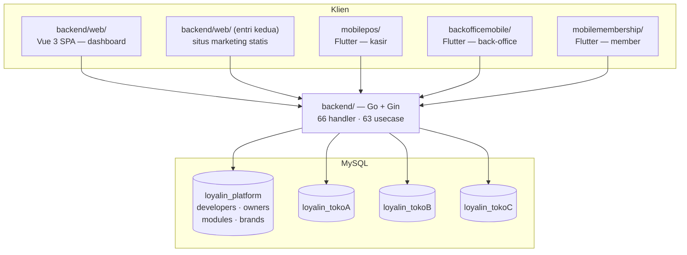

# Loyalin Reborn

> Platform point-of-sale dan loyalitas multi-tenant. Satu backend Go melayani
> dashboard web, situs marketing, dan tiga aplikasi Flutter — kasir, back-office,
> dan member.

| | |
|---|---|
| **Peran** | Fullstack — backend, web, dan ketiga aplikasi mobile |
| **Porsi commit** | 263 dari 618 (~43%) |
| **Periode** | Februari 2026 — Agustus 2026 |
| **Tim** | 2 pengembang |
| **Backend** | Go 1.25 · Gin · GORM · MySQL · Zap · Viper |
| **Web** | Vue 3 · Vite · Pinia · Tailwind CSS 4 |
| **Mobile** | Flutter · Dio |
| **Integrasi** | whatsmeow (WhatsApp) · iPaymu · Telegram · SMTP |
| **Ukuran** | ±231.000 baris · 313 Go · 222 Vue · 178 Dart |

---

## 1. Bentuk sistemnya

Satu repo, lima klien, satu backend.



**Perubahan kontrak API berpotensi merusak lima klien sekaligus.** Itu kenyataan yang
membentuk cara kerja di repo ini: dokumen arsitektur backend berisi daftar lengkap
endpoint supaya tidak ada yang perlu menebak, dan setiap sub-proyek punya dokumennya
sendiri.

---

## 2. Multi-tenancy: `DBManager`

Setiap pemilik usaha mendapat database sendiri (`loyalin_<slug>`). Database platform
menyimpan yang lintas-tenant: daftar owner, modul yang mereka langgan, dan katalog brand.

Yang menarik ada di `pkg/database/manager.go` — hanya 163 baris, tapi memegang bagian
paling berisiko:

```go
gormCfg := &gorm.Config{
    Logger:                                   logger.Default.LogMode(logMode),
    DisableForeignKeyConstraintWhenMigrating: true,
    // Keep disabled to prevent server-side prepared statement exhaustion
    // (max_prepared_stmt_count) on long-lived multi-tenant connections.
    PrepareStmt: false,
}
```

`PrepareStmt: false` itu keputusan yang tidak kelihatan penting sampai sistemnya punya
banyak tenant. GORM secara default menyiapkan (prepare) setiap query di sisi server dan
menyimpannya. Dengan koneksi yang hidup lama ke **puluhan database berbeda**, jumlah
prepared statement di MySQL naik terus sampai menabrak `max_prepared_stmt_count` — dan
kegagalannya muncul jauh dari penyebabnya, di query acak, berjam-jam kemudian.

Sisanya menyusul: pool per-owner dengan `MaxIdleConns` dan `MaxOpenConns` terpisah,
`ConnMaxLifetime` 30 menit, koneksi dengan retry, dan `RemoveConnection` untuk menutup
pool tenant yang dihapus.

---

## 3. Satu build, dua pintu

`backend/web/` membangun **dua halaman sekaligus** lewat `rollupOptions.input`:

| URL | Sumber | Sifat |
|---|---|---|
| `/` | `index.html` + `src/landing/` | HTML statis — isinya ditulis langsung di berkas |
| `/app/` | `app/index.html` + `src/` | Vue SPA, `noindex`, base router `/app/` |
| `/privacy`, `/hapus-akun` | `public/<nama>/index.html` | HTML statis mandiri |

Beranda **tidak boleh** jadi rute Vue, dan alasannya konkret: crawler WhatsApp,
Facebook, dan X tidak menjalankan JavaScript. Halaman yang dirender di klien terkirim
ke mereka sebagai `<div>` kosong, dan seluruh preview tautan mati — padahal WhatsApp
adalah kanal utama produk ini dibagikan.

Dulu ini proyek Nuxt terpisah. Digabung supaya satu `npm run build`, satu
`node_modules`, dan satu versi Tailwind.

Halaman `/privacy` dan `/hapus-akun` dibuat statis mandiri karena URL-nya terdaftar di
Google Play Console — kalau routing SPA meleset, aplikasinya bisa ditolak.

---

## 4. Yang saya kerjakan

Commit saya tersebar ke semua lapisan, bukan satu:

| Area | Sentuhan | Contoh pekerjaan |
|---|---|---|
| `backend/web/` | 385 | Halaman produk, POS web, katalog brand, navigasi berbasis sesi, halaman paket langganan |
| `backend/internal/` | 290 | Usecase penjualan, modul payroll, aturan peran, endpoint member |
| `mobilepos/lib/` | 279 | Layar kasir, pemindaian barcode dengan filter outlet, pencetakan |
| `backofficemobile/lib/` | 142 | Daftar produk, pembelian, penyesuaian stok |
| `backend/migrations/` | 75 | Prosedur registrasi mandiri yang aman terhadap tabel/kolom yang belum ada |
| `mobilepos/playstore/` | 56 | Aset listing, skrip tangkapan layar |
| Platform desktop/mobile | 400+ | Konfigurasi build iOS, Android, Windows, macOS, Linux, Web |

Beberapa yang saya ingat betul:

**Installer Windows berbahasa Indonesia.** Aplikasi kasir juga jalan di Windows.
Membuat installer-nya berbahasa Indonesia terdengar sepele sampai Anda sadar bahwa
penggunanya adalah kasir toko, bukan orang IT — dan prompt berbahasa Inggris adalah
titik di mana pemasangan berhenti dan berubah jadi tiket dukungan.

**Registrasi mandiri.** Prosedur migrasi yang membuat database tenant baru harus aman
dijalankan pada skema yang belum lengkap: menambahkan kolom yang hilang secara dinamis
dan menangani unique index yang mungkin sudah ada. Pendaftaran yang gagal di tengah
akan meninggalkan tenant setengah jadi — dan itu jauh lebih sulit dibersihkan daripada
dicegah.

**Polling status registrasi.** Setelah mendaftar, pengguna menunggu database-nya siap.
Auto-refresh dengan polling yang melambat sendiri, supaya halaman tidak terlihat macet
dan server tidak dibanjiri.

**Halaman privasi dan hapus akun.** Syarat Google Play. Dibuat statis, dengan redirect
sisi server yang mempertahankan hash URL — karena tautan yang dikirim Google membawa
fragment, dan redirect yang membuangnya membuat halamannya terbuka di posisi yang salah.

---

## 5. Aplikasi kasir Flutter

`mobilepos/` adalah bagian yang paling jauh dari "aplikasi CRUD":

- **`print_bluetooth_thermal`** — cetak struk ke printer thermal Bluetooth.
- **`flutter_libserialport`** — komunikasi serial, untuk perangkat yang tidak Bluetooth.
- **`permission_handler`** — izin Bluetooth dan lokasi di Android modern, yang aturannya
  berubah hampir tiap versi.
- **Satu basis kode, empat target rilis** — Android, iOS, Windows, dan Web, masing-masing
  dengan konfigurasi build sendiri.

Cetak struk adalah fitur yang tidak boleh gagal. Kasir tidak bisa bilang ke pelanggan
"tunggu, aplikasinya sedang mencoba lagi".

---

## 6. Angka

| | |
|---|---|
| Commit total | 618 (263 milik saya) |
| Baris kode sumber | ±231.000 |
| Berkas Go | 313 |
| Handler / usecase | 66 / 63 |
| Komponen Vue | 222 |
| Berkas Dart | 178 di 3 aplikasi |
| Klien yang dilayani satu API | 5 |

---

## 7. Catatan jujur

Dokumen arsitektur di repo ini menyebut Midtrans dan GORM DBResolver sebagai bagian
dari tech stack. Saat saya menyusun case study ini, saya periksa ulang ke kodenya:
gateway yang benar-benar terpasang adalah **iPaymu**, dan multi-tenancy-nya memakai
`DBManager` buatan sendiri, bukan DBResolver.

Dokumen yang tertinggal dari kodenya adalah hal biasa di proyek yang bergerak cepat —
tapi karena portofolio ini bisa dipakai orang untuk menilai saya, angkanya saya ambil
dari `git` dan klaim teknisnya saya ambil dari kode, bukan dari dokumen.

---

← [Kembali ke daftar case study](README.md)
