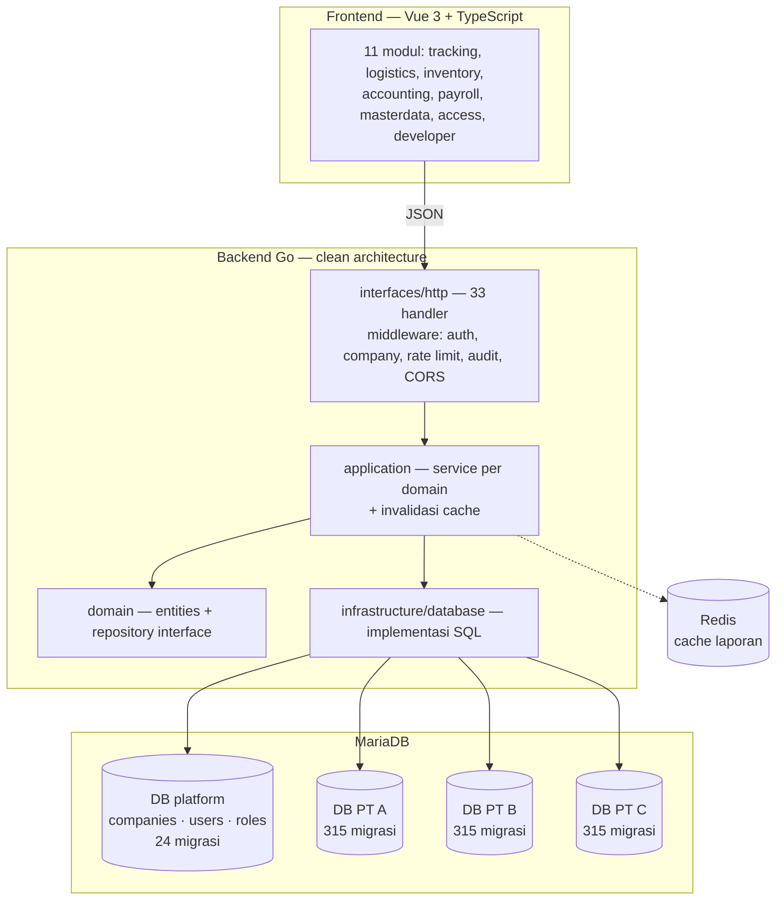
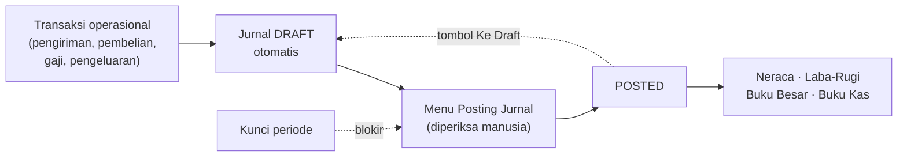

# Sawit Tracking

> Sistem logistik kelapa sawit yang menyatu dengan pembukuan akuntansi penuh.
> Satu perusahaan angkutan memakainya untuk melacak pengiriman, menagih gudang,
> menggaji supir, dan menutup buku — dalam satu aplikasi.

| | |
|---|---|
| **Peran** | Pengembang utama |
| **Porsi commit** | 362 dari 561 (~65%) |
| **Periode** | April 2026 — Agustus 2026 |
| **Tim** | 2 pengembang |
| **Backend** | Go 1.25 · `net/http` · MariaDB · Redis |
| **Frontend** | Vue 3 (`<script setup>`) · TypeScript · Vite · Leaflet |
| **Ukuran** | ±200.000 baris · 135 berkas Go · 157 komponen Vue · 339 migrasi |

---

## 1. Masalahnya

Perusahaan angkutan sawit punya dua dunia yang tidak pernah bertemu:

**Dunia lapangan.** Truk mengangkut tandan dari kebun ke gudang. Ada susut —
berat yang hilang di jalan. Ada supir yang harus digaji per rit, dipotong pinjaman,
dipotong deposit. Ada kendaraan milik sendiri dan kendaraan sewa dari pemilik lain.

**Dunia pembukuan.** Akuntan butuh jurnal, buku besar, neraca, laba-rugi, dan tutup
tahun. Selama ini datanya diketik ulang dari catatan lapangan ke Excel, lalu diketik
ulang lagi ke software akuntansi.

Setiap pengetikan ulang adalah kesempatan untuk salah. Dan begitu neraca tidak
seimbang, tidak ada yang tahu salahnya di pengetikan yang mana.

Sistem ini menghapus pengetikan ulang itu: **setiap transaksi operasional otomatis
melahirkan jurnalnya sendiri.**

---

## 2. Arsitektur



Lapisannya dipisah tegas: `domain/` hanya berisi struct dan interface repository,
`application/` berisi logika bisnis, `infrastructure/` berisi SQL. Handler tidak
pernah menyentuh SQL, dan repository tidak pernah tahu soal HTTP.

**Tanpa framework web.** Backend memakai `net/http` dari pustaka standar — router,
rantai middleware, dan penanganan galat ditulis sendiri. Ini bukan keras kepala:
sistemnya berumur panjang dan dipegang tim kecil, jadi satu dependensi besar yang
suatu hari berubah API-nya adalah biaya yang tidak perlu dibayar. Yang dipakai dari
luar hanya yang benar-benar sulit ditulis sendiri: driver MySQL, JWT, `decimal`
untuk uang, `excelize` untuk export, dan klien Redis.

**Multi-tenant database-per-PT.** Tiap perusahaan punya database sendiri
(`db_pt_<nama>`). Datanya tidak pernah bisa bocor antar-PT karena memang tidak
pernah berada di tabel yang sama. Konsekuensinya: dua pohon migrasi terpisah —
315 migrasi per-perusahaan dan 24 migrasi platform — yang jalan otomatis saat
backend menyambung ke pool dan tercatat di tabel `_migrations`.

---

## 3. Inti sistem: alur jurnal

Ini bagian yang paling menentukan benar-tidaknya seluruh sistem.



Tiga aturan yang dijaga ketat:

1. **`postJournalTx` menolak jurnal yang debit ≠ kredit.** Bukan peringatan — gagal.
2. **Semua laporan hanya membaca `status = 'posted'`.** Draft belum berdampak apa pun,
   jadi transaksi yang salah bisa diperbaiki tanpa mengotori laporan.
3. **Kunci periode.** `assertPeriodOpen` memblokir posting dan edit untuk tanggal
   di bawah `accounting_settings.lock_date`. Setelah tutup tahun, buku benar-benar tutup.

---

## 4. Tiga keputusan yang layak diceritakan

### a. Penjaga bagan akun — setelah kejadian yang mahal

Tiap PT punya bagan akun (Chart of Accounts) yang berbeda, dan **akuntannya membuat
akun sendiri**. Kode akun yang kosong di satu PT bisa saja sudah dipakai di PT lain.

Ada satu migrasi yang memakai pola yang kelihatan aman:

```sql
INSERT ... ON DUPLICATE KEY UPDATE name = VALUES(name)
```

Pola itu diam-diam mengganti **nama akun yang sudah ada**. Tabel `audit_log` ada di
skema tapi tidak pernah diisi kode mana pun — jadi nama lamanya hilang permanen.
Kejadian nyata: satu migrasi menimpa akun `5110.002` milik akuntan, dan yang bisa
dilakukan hanya membuat migrasi berikutnya untuk memperbaikinya.

Yang saya bangun setelah itu:

- **Larangan pola tersebut**, ditulis sebagai aturan wajib di dokumen proyek.
- **Resolver berbasis nama, bukan kode**, untuk akun yang kodenya tidak penting
  (sub-akun per supplier, per pemilik, per kategori): cari lewat nama di bawah
  induknya, buat dengan nomor urut `MAX+1` bila belum ada.
- **`MAX+1` ikut menghitung baris ter-soft-delete**, karena kode unik lintas baris
  terhapus. Memakai `INSERT` biasa — kalau bentrok, gagal dengan galat, tidak pernah menimpa.
- **`backend/scripts/cek-migrasi-coa.sh`** — skrip yang memeriksa migrasi baru sebelum
  commit dan menolak pola berbahaya.

Prinsip yang saya ambil: **lebih baik akun sistem gagal dibuat — dan ketahuan saat
dipakai — daripada data akuntan tertimpa tanpa ada yang sadar.**

### b. Resolver header-safe

Bagan akun berbentuk pohon. Akun "header" (`is_header = 1`) hanya wadah untuk
rollup laporan; memposting jurnal ke sana merusak penjumlahan dan memunculkan UUID
mentah di layar koreksi jurnal.

Karena jurnal otomatis dibuat dari kode akun yang dipatok di dalam kode Go, satu
perusahaan yang kebetulan menjadikan kode itu sebagai header akan langsung bermasalah.
Solusinya `resolveNonHeaderCOATx(code)`:

- Kalau akun tujuannya header dan punya anak → pakai anak leaf pertama.
- Kalau header **tanpa anak** → buat otomatis anak `<kode>.NNN`.
- Kalau bukan header → pakai apa adanya.

Jurnal otomatis jadi tidak pernah bisa mendarat di akun header, apa pun bentuk bagan
akun yang dibuat akuntannya.

### c. Aturan paginasi yang lahir dari bug diam

Ada bug yang tidak pernah memunculkan galat: backend memberi default 20 baris kalau
`limit` tidak dikirim. Beberapa halaman daftar tidak mengirim `limit`, jadi data lama
**hilang dari layar tanpa pesan apa pun**. Pengguna mengira datanya memang tidak ada.

Yang berbahaya bukan bug-nya, tapi bahwa bug itu bisa muncul lagi di setiap menu baru.
Jadi ini ditulis sebagai aturan wajib proyek:

- Endpoint list **wajib** menerima `limit` + `offset` dan mengembalikan `{items, total}`.
- Frontend **wajib** mengirim `limit` eksplisit dan menyimpan `total`.
- Daftar transaksi **wajib** paginasi 50/halaman lewat composable `usePagination`.
- Ringkasan dan statistik diambil dari agregat backend — **bukan** menjumlahkan baris
  halaman yang sedang aktif.
- Export Excel memakai seluruh data terfilter, bukan halaman aktif.

---

## 5. Domain yang ditangani

| Modul | Isi |
|---|---|
| `tracking` | Pengiriman, bongkar-muat, GPS armada |
| `logistics` | Invoice gudang, penagihan, susut, PPh per tarif |
| `inventory` | Pembelian produk, stok, akrual hutang supplier |
| `accounting` | COA, jurnal, buku besar, buku kas & bank, neraca, laba-rugi, tutup tahun |
| `payroll` | Gaji supir & trucking, potongan, pinjaman, deposit, slip |
| `masterdata` | Supplier, kendaraan, pemilik, tarif pajak, rekening |
| `access` | Peran, izin, penugasan pengguna ke perusahaan |
| `developer` | Area platform lintas-PT — pembuatan perusahaan, akun developer |

Contoh alur yang paling rumit — **gaji supir** — mengikuti model yang diminta akuntan:
beban diakui **saat bongkar**, bukan saat gajian. Saat bongkar dibuat
`Dr Beban Gaji Supir / Cr Hutang Gaji Supir` bertanggal tanggal bongkar. Saat gajian
dibuat satu jurnal yang persis mencerminkan catatan akuntan: hutang gaji didebit,
potongan dan PPh dikredit, sisanya kas.

Data lama yang belum punya akrual bongkar tetap jalan dengan perilaku lama lewat rumus
adaptif — tidak ada beban yang hilang, tidak ada yang dobel.

---

## 6. Angka

| | |
|---|---|
| Commit total | 561 (362 milik saya) |
| Baris kode sumber | ±200.000 |
| Berkas Go | 135 |
| Komponen Vue | 157 |
| Handler HTTP | 33 |
| Migrasi | 315 perusahaan + 24 platform |
| Modul domain | 11 |
| Dependensi Go langsung | 9 |

---

## 7. Yang saya pelajari

**Dokumentasi yang paling berguna adalah dokumentasi tentang cara gagal.** Dokumen
proyek ini berisi lebih banyak "jangan lakukan ini, dan ini alasan nyatanya" daripada
"begini cara memakainya". Setiap larangan punya nomor migrasi sebagai bukti.

**Bug yang tidak memunculkan galat adalah bug termahal.** Data yang hilang diam-diam
dari layar tidak akan pernah dilaporkan sebagai bug — pengguna hanya kehilangan
kepercayaan pada sistemnya, perlahan.

**Pengguna bukan akuntan.** Fitur akuntansi harus dijelaskan tanpa mengasumsikan orang
paham debit dan kredit. Ini mengubah cara menamai menu, menulis pesan galat, dan
menyusun form — dan ternyata lebih sulit daripada menulis mesin jurnalnya.

---

← [Kembali ke daftar case study](README.md)
