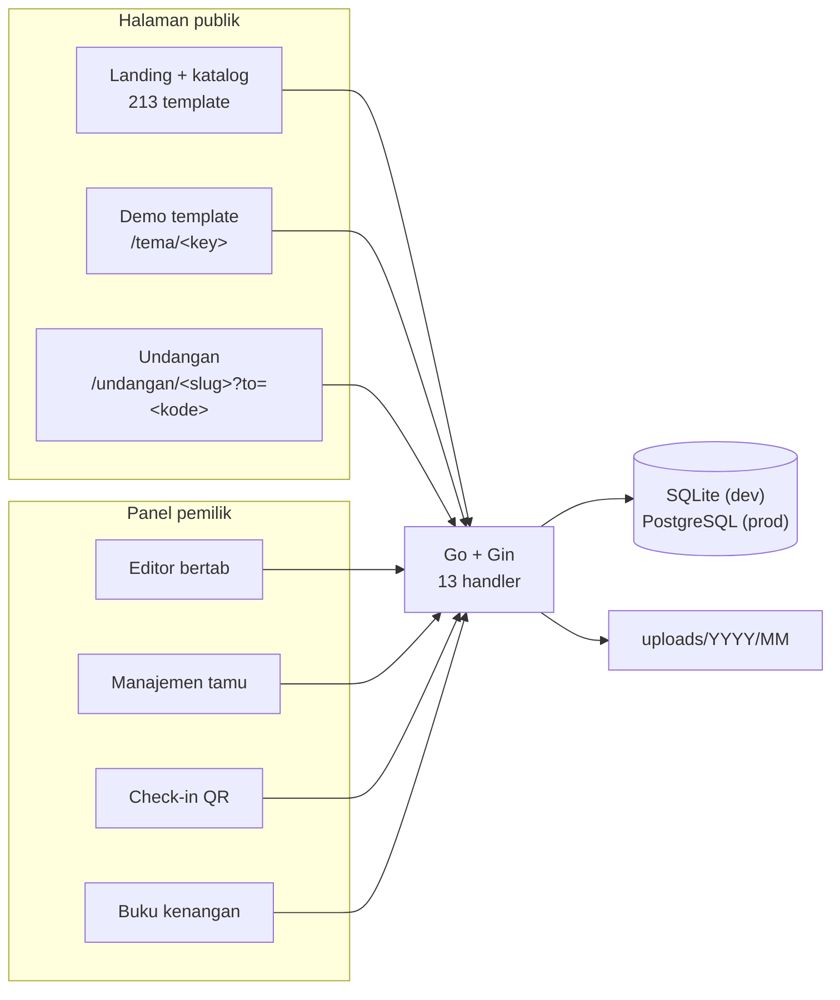

# Undangan Digital

> Platform undangan pernikahan digital. Satu akun membuat banyak undangan, tiap tamu
> mendapat tautan personal, dan pemiliknya memantau RSVP dari panelnya sendiri.

| | |
|---|---|
| **Peran** | Pengembang tunggal — backend, frontend, desain template |
| **Periode** | 2026 |
| **Backend** | Go 1.25 · Gin · GORM · SQLite (dev) → PostgreSQL (produksi) |
| **Frontend** | Vue 3 · TypeScript · Vite · Tailwind CSS 4 · Pinia · GSAP |
| **Integrasi** | Google Identity Services (OIDC) · iPaymu |
| **Ukuran** | ±42.000 baris · 81 komponen Vue · 45 berkas Go · 213 template |

---

## 1. Kenapa ini berbeda dari proyek lain saya

Proyek lain di portofolio ini dipakai karyawan yang **dibayar untuk memakainya**.
Yang ini dipakai orang yang sedang menikah dan tamunya — orang yang akan menutup tab
kalau halamannya lambat, dan tidak akan pernah melapor kenapa.

Konsekuensinya, ukuran keberhasilannya berbeda: bukan kelengkapan fitur, tapi
**seberapa cepat undangan terbuka di jaringan seluler yang buruk, di ponsel yang tidak
baru.**

---

## 2. Arsitektur



**SQLite di lokal, PostgreSQL di produksi.** Menjalankan proyek ini cukup
`go run ./cmd/api` — tidak ada langkah "pasang database dulu". Data demo dibuat
otomatis. Produksi tinggal mengganti variabel lingkungan. Ini keputusan kecil yang
berdampak besar pada seberapa sering saya benar-benar menjalankan proyeknya.

---

## 3. Katalog 213 template dari satu set variabel

Ini bagian yang paling saya banggakan secara teknis, karena hasilnya terlihat besar
padahal biayanya kecil.

Setiap template **bukan** salinan markup. Setiap template hanya berisi custom property
CSS dan beberapa opsi tata letak. Seluruh komponen undangan memakai utility Tailwind
yang merujuk variabel itu — `bg-gold`, `text-deep`, `font-display` — jadi mengganti
template cukup dengan menimpa variabelnya.

```
Menambah template baru = satu panggilan defTheme() di index.ts,
lalu daftarkan key-nya di backend (models.Themes) supaya lolos validasi.
```

Hasilnya: **213 template dalam 23 kategori**, ±9.600 baris definisi tema, **nol**
duplikasi markup.

Kategorinya sendiri hasil keputusan produk, bukan sekadar rak:

- **Kategori keagamaan dipisah per agama** — Islami, Kristiani, Hindu, Buddha,
  Konghucu — bukan disatukan jadi satu kategori "rohani". Pemilik undangan Kristen tidak
  perlu menyisir template Islam dan Hindu dulu untuk menemukan yang dipakainya.
- **Kategori bergerak dipisah dari kategori rupa.** "Panggung 3D" baru bergerak kalau
  disentuh; "Ruang 3D" berputar sendiri. Di layar pembuka yang cuma dipandang beberapa
  detik, itu perbedaan yang menentukan — jadi keduanya kategori terpisah.
- **"Rambat Hidup"** dipisah dari "Bunga" karena tanamannya benar-benar tumbuh lalu
  bergoyang, dan itu tidak bisa ditunjukkan kartu katalog yang diam.

Kartu pratinjau di katalog dirender memakai warna dan tipografi template itu sendiri,
dan di halaman demo pengunjung bisa berganti template dari bar atas **tanpa kehilangan
posisi scroll** — supaya perbandingan antar-template terjadi pada bagian yang sama.

---

## 4. Keputusan yang lahir dari batasan nyata

### a. Kompresi foto di browser, sebelum diunggah

Foto pre-wedding keluar dari kamera dengan ukuran belasan megabyte. Kalau dikirim apa
adanya: unggahannya lama bagi pemilik undangan, dan undangannya berat bagi tamu.

`frontend/src/utils/image.ts` mengecilkan foto di browser sebelum dikirim:

```ts
const { maxSize = 1600, quality = 0.82, skipBelowKB = 300 } = options
```

Sisi terpanjang dipotong ke 1600px, dikompresi ke JPEG kualitas 0,82, dan **dilewati
sama sekali kalau berkasnya sudah di bawah 300 KB** — tidak ada gunanya mengompresi
ulang foto yang sudah kecil, dan mengompresi ulang justru menurunkan kualitas tanpa
menghemat apa pun.

Contoh nyata dari proyeknya: PNG 3,6 MB menjadi JPEG 286 KB.

### b. Satu tempat untuk pemetaan warna

Empat view merender undangan: halaman publik, pratinjau di iframe, buku tamu, dan demo
template. Masing-masing perlu memetakan kolom database (`warna_aksen`, `warna_latar`,
`warna_sampul`, `warna_teks`) ke custom property CSS.

Menulis pemetaan itu empat kali adalah empat kesempatan untuk lupa satu kanal. Dan yang
lupa **tidak memunculkan galat** — warnanya sekadar tidak berlaku, dan tidak ada yang
sadar sampai ada pemilik undangan yang bingung kenapa warnanya tidak berubah.

Jadi pemetaannya tinggal di satu composable, `warnaUndangan()`, dan keempat view
memanggilnya.

### c. Konfigurasi Google hanya di satu sisi

Client ID Google cukup diisi di `backend/.env`. Frontend mengambilnya lewat
`GET /api/v1/public/config` — supaya tidak ada dua tempat konfigurasi yang bisa berbeda
isinya. Kalau Client ID tidak diisi, tombol Google tidak muncul dan aplikasinya tetap
jalan penuh.

---

## 5. Fitur yang tidak terlihat dari luar

| Fitur | Kenapa ada |
|---|---|
| **Check-in QR di pintu masuk** | Panitia memindai QR tamu saat acara. Endpoint-nya milik pemilik undangan — tamu tidak pernah bisa mencatatkan kehadirannya sendiri, hanya menunjukkan QR-nya |
| **Buku kenangan** | Tamu menulis pesan yang bisa dicetak jadi buku setelah acara |
| **Pengingat** | Penjadwalan pesan ke tamu yang belum merespons |
| **Tautan personal per tamu** | `?to=<kode>` — nama tamu muncul di layar sampul |
| **Statistik dibuka** | Siapa yang sudah membuka undangannya, bukan sekadar jumlah |
| **Unggah massal galeri** | Tarik-lepas banyak berkas, progres per berkas, urutan bisa diubah |
| **Peta lokasi tersemat** | Tempel URL Google Maps, koordinatnya diambil otomatis |

---

## 6. Pengujian

Ini proyek dengan cakupan pengujian terbaik yang saya punya: **32 fungsi test di
14 berkas**, seluruhnya di Go.

Yang diuji adalah bagian yang gagalnya mahal dan sunyi:

- **Tanda tangan permintaan iPaymu** — `TestSignSesuaiImplementasiReferensi`,
  `TestMarshalBodyTidakMengescapeHTML`, `TestMarshalBodyTanpaNewlineDiAkhir`. Tanda
  tangan yang meleset satu byte akan ditolak gateway dengan pesan yang tidak menjelaskan
  apa pun.
- **`TestModeSelainProductionSelaluSandbox`** — pengaman supaya salah ketik pada
  variabel lingkungan tidak pernah berujung transaksi sungguhan.
- Masa aktif undangan, batas paket, sinkronisasi data mempelai, naskah per agama,
  dan tingkatan tema.

---

## 7. Angka

| | |
|---|---|
| Baris kode sumber | ±42.000 |
| Komponen Vue | 81 (61 di antaranya komponen bersama) |
| Berkas Go | 45 · 13 handler |
| Template | 213 dalam 23 kategori |
| Baris definisi tema | ±9.600 |
| Fungsi test | 32 di 14 berkas |
| Peran | Solo, end-to-end |

---

## 8. Yang saya pelajari

**Abstraksi yang tepat mengubah ekonomi produk.** 213 template tidak mungkin dibuat
kalau tiap template adalah salinan markup. Karena template hanya berupa variabel,
menambah satu template memakan menit, bukan hari — dan itu yang membuat katalognya bisa
tumbuh sebesar ini.

**Kegagalan yang sunyi butuh test, bukan kehati-hatian.** Warna yang tidak berlaku dan
tanda tangan pembayaran yang meleset punya satu kesamaan: tidak ada yang memberi tahu
Anda. Yang pertama saya selesaikan dengan menghapus duplikasinya, yang kedua dengan
menulis test-nya.

**README bisa ketinggalan dari kodenya.** README proyek ini menyebut 85 template dalam
12 kategori. Saat menyusun case study ini saya hitung ulang dari kode: 213 dalam 23.
Angka di halaman ini datang dari kode.

---

← [Kembali ke daftar case study](README.md)
