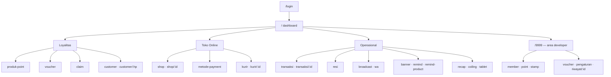

# VapeKanbaru Admin

> Panel operasional untuk jaringan ritel: program stempel loyalitas, voucher, katalog
> toko online, kurir dan resi pengiriman, broadcast WhatsApp, sampai area khusus developer.

| | |
|---|---|
| **Peran** | Pengembang utama panel admin |
| **Porsi commit** | 26 dari 47 (~55%) |
| **Periode** | Januari 2024 — Maret 2025 |
| **Stack** | Nuxt 2 · Vue 2 · Tailwind CSS · PWA · Axios |
| **Ukuran** | ±14.000 baris · 40+ halaman |

---

## 1. Konteks

Ini proyek produksi pertama yang sisi panelnya saya pegang. Backend-nya
(`vapekanbaru-api`, Express + Knex + Redis) dikerjakan rekan tim; saya mengerjakan
antarmuka yang dipakai staf toko setiap hari.

Bisnisnya ritel dengan beberapa cabang. Yang harus ditangani panel ini bukan satu
produk, melainkan beberapa sistem yang tumbuh bertahap:

- **Loyalitas** — program stempel, poin produk, penukaran voucher, klaim pelanggan
- **Toko online** — katalog, metode pembayaran, kurir, ongkos kirim
- **Operasional** — transaksi, resi pengiriman, banner, broadcast WhatsApp
- **Area developer** (`/9999`) — pengaturan tingkat sistem, terpisah dari menu staf

---

## 2. Peta halaman

Area `/9999` sengaja dipisah total — punya login, logout, dan layout sendiri. Menu
pengaturan tingkat sistem tidak pernah muncul di navigasi staf toko, jadi tidak ada
tombol berbahaya yang tinggal salah klik.

---

## 3. Yang saya kerjakan

Diurutkan dari yang paling berdampak:

### Modul toko online (April–Mei 2024)

CRUD lengkap untuk metode pembayaran, daftar toko, dan kurir — termasuk halaman detail
per entitas. Saya juga melakukan **pengelompokan ulang folder** menjadi
`vapekanbaru_shop/`, karena halaman toko sudah mulai tercampur dengan halaman loyalitas
dan sulit dicari.

### Daftar dan detail transaksi (April 2024)

Halaman transaksi adalah yang paling sering dibuka staf. Dibangun bertahap: daftar
transaksi, lalu halaman detail, lalu penyempurnaan filter dan pencarian.

### Pelacakan resi (Januari 2025)

Halaman resi pengiriman dengan **tautan pelacakan langsung ke kurir**. Ditambahkan
setelah tim CS kewalahan menjawab pertanyaan yang sama berulang-ulang: "paket saya di
mana?" Sebelumnya nomor resi memang tercatat, tapi harus disalin dan ditempel manual ke
situs kurir.

### Pengaturan pengingat (Maret 2025)

Halaman pengaturan pengingat beserta integrasi menunya — mengatur kapan pelanggan
diingatkan tentang produk yang habis atau perlu dibeli ulang.

### Pencarian pelanggan (Januari 2024)

Menambahkan tombol submit pada pencarian pelanggan. Terdengar sepele, tapi sebelumnya
pencarian berjalan otomatis setiap ketikan — di data pelanggan yang besar, itu berarti
puluhan permintaan ke server untuk satu kata yang diketik.

---

## 4. Catatan teknis

**Nuxt 2 sebagai PWA.** Panel ini dipakai dari tablet di konter toko, bukan hanya
desktop. Ada halaman `/tablet` khusus, dan pemindai QR lewat kamera
(`vue-qrcode-reader`) untuk membaca kartu stempel pelanggan.

**Export Excel dari sisi klien** (`vue-json-excel`) — staf toko sering butuh menarik
rekap ke Excel untuk keperluan yang tidak pernah bisa diprediksi sebelumnya. Membiarkan
mereka mengekspor sendiri lebih murah daripada membangun satu laporan baru tiap ada
permintaan.

**`vue-bottom-sheet`** untuk aksi di layar sempit — pola mobile, bukan modal desktop
yang dipaksa muat.

---

## 5. Angka

| | |
|---|---|
| Commit total | 47 (26 milik saya) |
| Baris kode sumber | ±14.000 |
| Halaman | 40+ |
| Rentang | Jan 2024 — Mar 2025 |
| Tim | 3 kontributor |

---

## 6. Yang saya pelajari

**Panel internal punya penggunanya sendiri, dan mereka tidak bisa memilih.** Staf toko
tidak bisa pindah ke produk lain kalau panelnya menyebalkan — mereka hanya jadi lebih
lambat, dan itu tidak pernah muncul di metrik mana pun. Menambahkan tautan pelacakan
resi memakan waktu sebentar dan menghapus pekerjaan salin-tempel yang terjadi puluhan
kali sehari.

**Struktur folder adalah dokumentasi.** Pengelompokan ulang ke `vapekanbaru_shop/`
tidak mengubah satu pun perilaku aplikasi, tapi mengubah berapa lama waktu yang
dibutuhkan untuk menemukan halaman yang mau diperbaiki.

---

← [Kembali ke daftar case study](README.md)
